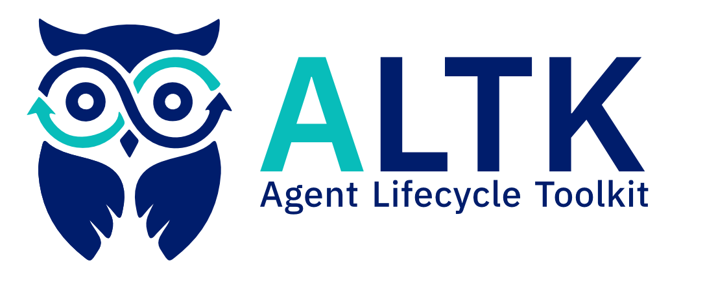

<h1 align="center" >
    
</h1>

<h4 align="center">Improve AI agent performance over time with plug-and-play, framework-agnostic technology</h4>

<div style="text-align: center;">

<tr>
<td align="center">
  <a href="https://github.com/AgentToolkit/" style="text-decoration: none; color: inherit;"><b>Star us on GitHub!</b></a> &nbsp; <a href="https://github.com/AgentToolkit/">
    
  </a>
</td>
</tr>
<br>
<tr>
<td align="center">
  <a href="https://www.youtube.com/@AgentToolkit" style="text-decoration: none; color: inherit;"><b>Subscribe to our YouTube channel</b></a> &nbsp; <a href="https://www.youtube.com/@AgentToolkit">
    
  </a>
</td>
</tr>
</div>


## What is ALTK?
The Agent Lifecycle Toolkit helps agent builders improve their agent with minimal integration effort and setup. These components allow the agent to improve over time through evaluation, testing, analytics, and continuous improvement — from first deployment through production maturity and beyond.

<div align="center">

</div>

- *Does your agent make the same mistake twice?*
<br> [Kaizen](kaizen.md) generates guidelines from past trajectories and injects them into the agent's prompt to help the agent avoid repeating the same mistake. 

## Installation
To use ALTK, simply install it from your package manager, e.g. pip:

```bash
pip install kaizen
```

## Getting Started
Refer to the following [quick start](kaizen.md#quick-start) guide.

