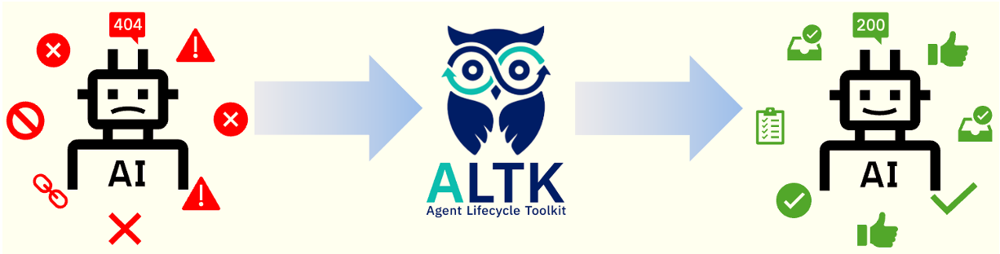

The Agent Lifecycle Toolkit helps agent builders improve their agents over time with minimal integration effort. These components allow agents to learn from their own trajectories — evolving continuously from first deployment through production maturity and beyond.

## Evolve
<figure markdown="span">
  { height="120" }
  <figcaption>Does your agent make the same mistake twice?</figcaption>
</figure>

[Evolve](../evolve) generates guidelines from past trajectories and injects them into the agent's prompt to help avoid repeating mistakes.

Evolve is a system designed to help agents improve over time by learning from their trajectories. It uses a combination of an MCP server for tool integration, vector storage for memory, and LLM-based conflict resolution to refine its knowledge base.

[Learn more about Evolve →](../evolve)

## Build
Components crafted to slot easily into agent pipelines. Address gaps in the stages of your agent lifecycle: in reasoning, tool calling errors, or outputting guidelines.

[Learn more about the Agent Lifecycle Toolkit →](../agent-lifecycle-toolkit)

---
## Can't find what you're looking for?

If you were looking for some of the ALTK components released in 2025, you can still find them [here](https://agenttoolkit.github.io/agent-lifecycle-toolkit/).